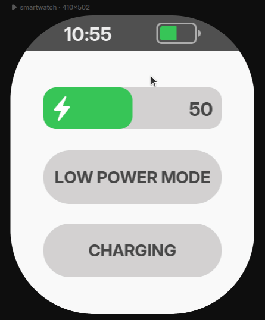
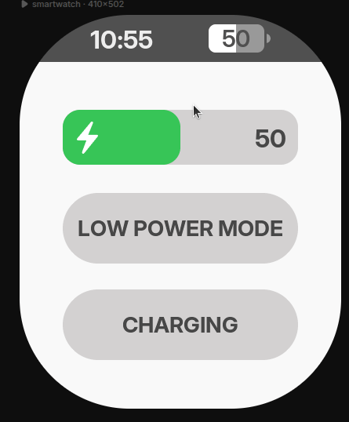
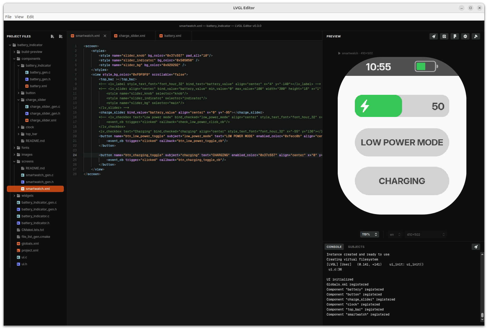
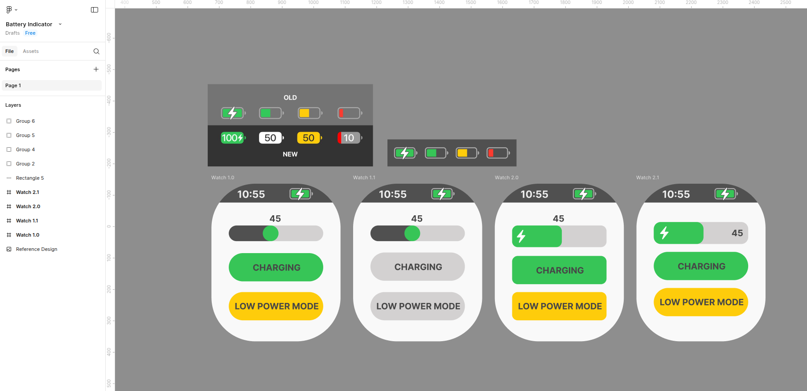
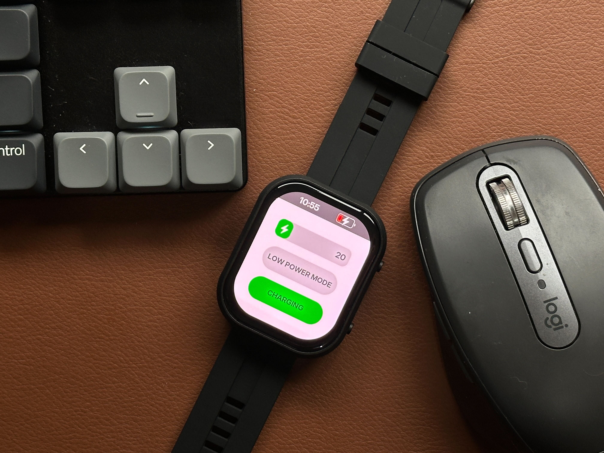

# An iOS inspired battery indicator made in LVGL's UI Editor

<!-- 
 -->

<p align="center">
  
  
</p>

This project is a battery indicator component example to be used in LVGL's UI Editor.
It includes 3 different battery indicator designs that explore XML components, data bindings and custom widgets (XML + C custom code).

To test each battery design, chose one of them in the `top_bar.xml` file inside `components/top_bar`:
```
<!-- Try here the 3 different battery indicators -->

<!-- Old iOS battery indicator, full XML component -->
<!-- <battery align="right_mid"></battery> -->

<!-- New iOS battery indicator, without the normal light state, full XML component -->
<!-- <battery_indicator_2 align="right_mid"></battery_indicator_2> -->

<!-- New iOS battery indicator with light state and fully functional as a widget (XML + custom C code) -->
<wd_battery bind_charging="charging" bind_low_power="low_power_mode" bind_value="battery_value" align="right_mid"></wd_battery>
```

Download this repo and open the `battery_indicator` folder in the Editor.



You can also see it live in the online preview: [Battery Indicator Online Live Preview](https://viewer.lvgl.io/?repo=giobauermeister/battery-indicator-lvgl-editor/tree/main/battery_indicator)

Figma design. Access [here](https://www.figma.com/design/HVvM9m0egZy0wYZDLKKPTA/Battery-Indicator).



Tested in a real hardware. Waveshare smartwatch: [https://www.waveshare.com/esp32-s3-touch-amoled-2.06.htm](https://www.waveshare.com/esp32-s3-touch-amoled-2.06.htm)



Please visit [https://lvgl.io/editor](https://lvgl.io/editor) for more information.

